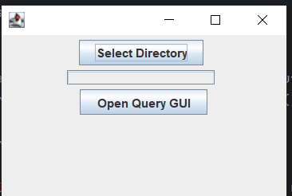

# Information-Retrieval-System-with-SubSystem-for-Its-Rating
This project was built during the CS463 course (Spring 2024)

### Main Menu

### Selected Collection

### How it looks when running the .jar file

### Query System

### Query System Result

